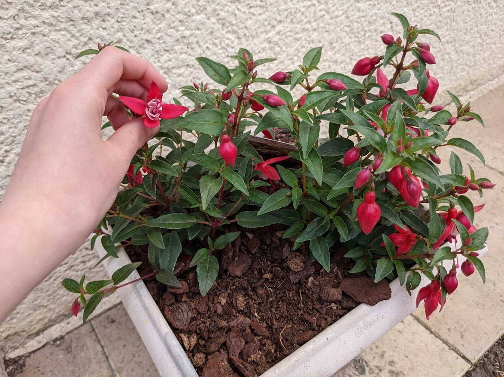
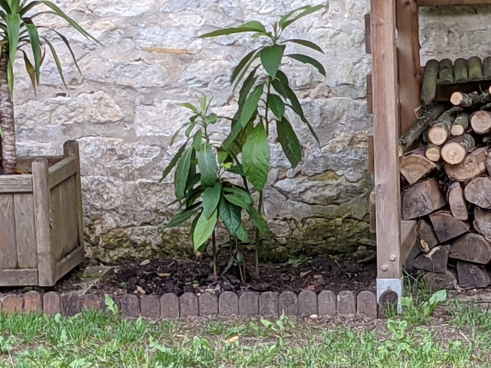
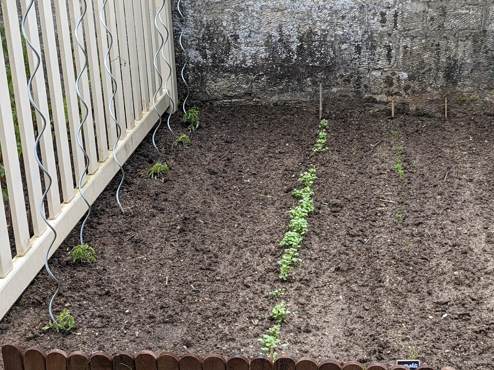
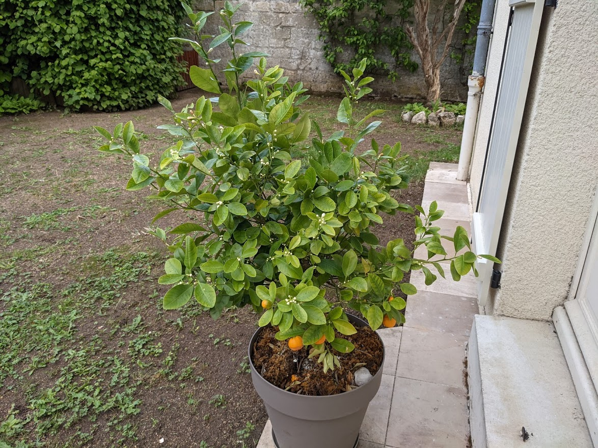
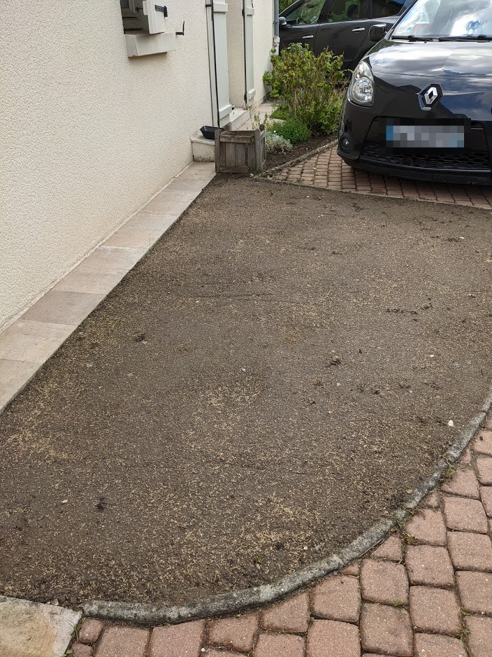

on a planté les pétunia en haut,   
la ciboulette et les courgettes pousseent bien.

les fushias fleurissent.

on a planté un avocat.

les carottes comencent à pousser,   
les radis sont grands,  
un plant de tomate est mort mais il en reste encore 5!

on a mit un oranger,  
il y a quelques oranges

on a enlevée la mousse et après on a semée l'herbe

:) Mathilde (:
